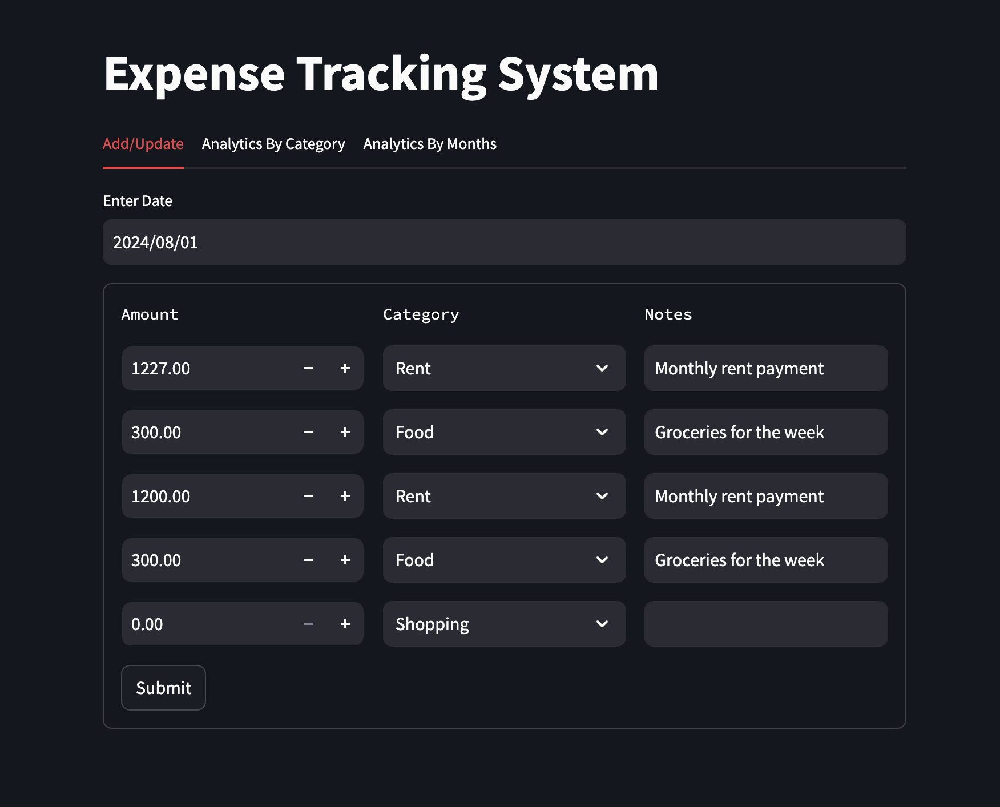
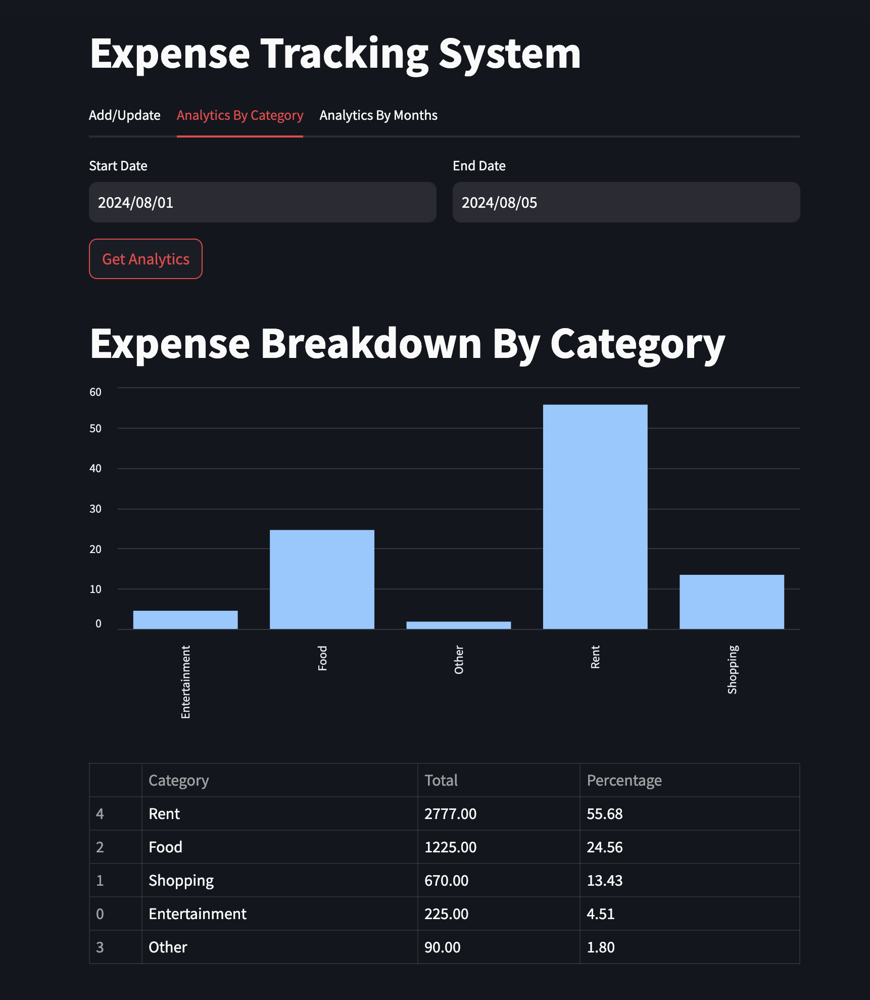
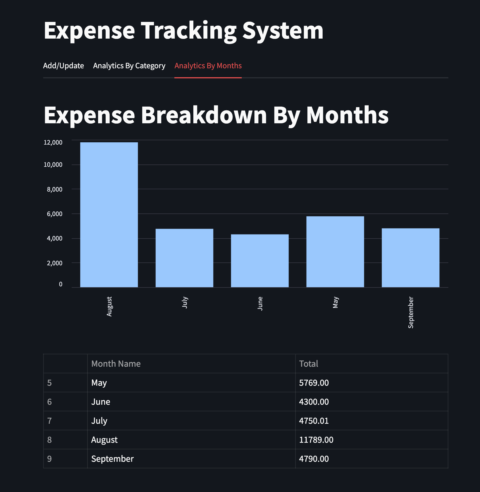

# Expense Management System

This project is an expense management system that consists of a Streamlit frontend application and a FastAPI backend server.


## Project Structure

- **frontend/**: Contains the Streamlit application code.
- **backend/**: Contains the FastAPI backend server code.
- **tests/**: Contains the test cases for both frontend and backend.
- **assets/**: Contains all the image files required.
- **requirements.txt**: Lists the required Python packages.
- **README.md**: Provides an overview and instructions for the project.


## Setup Instructions

1. **Clone the repository**:
   ```bash
   git clone https://github.com/yourusername/expense-management-system.git
   cd expense-management-system
   ```
1. **Install dependencies:**:   
   ```commandline
    pip install -r requirements.txt
   ```
1. **Run the FastAPI server:**:   
   ```commandline
    uvicorn server.server:app --reload
   ```
1. **Run the Streamlit app:**:   
   ```commandline
    streamlit run frontend/app.py
   ```

## UI Screenshots

### Home Page


### Category Analytics Page


### Monthly Analytics Page
